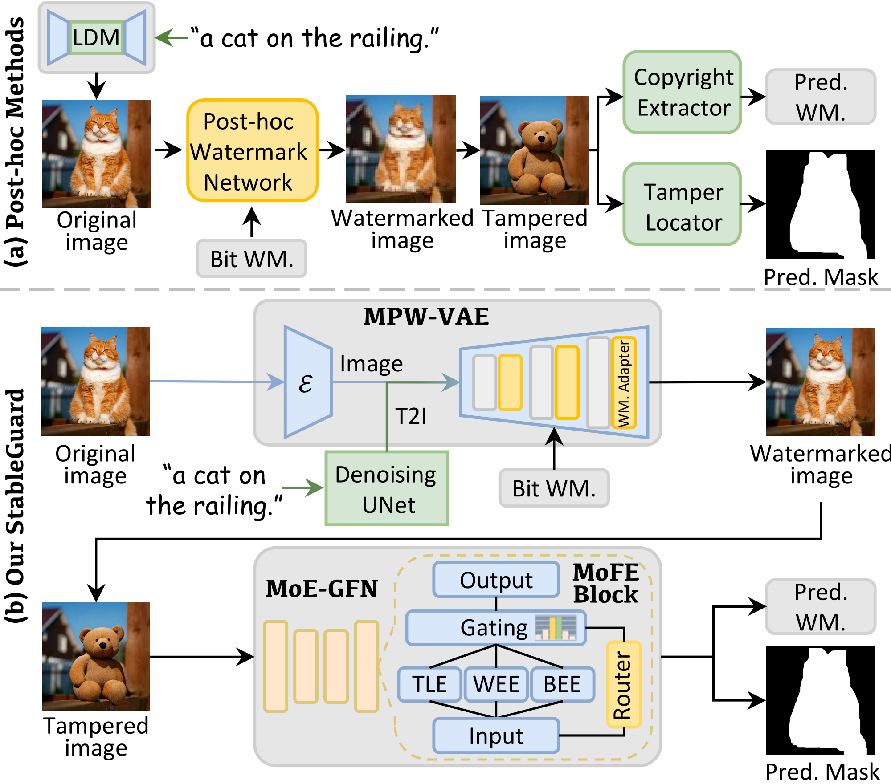

# StableGuard: Towards Unified Copyright Protection and Tamper Localization in Latent Diffusion Models (NeurIPS 2025)
---

*This repo contains the training and inference code for our StableGuard paper (NeurIPS 2025).*

> **[StableGuard: Towards Unified Copyright Protection and Tamper Localization in Latent Diffusion Models](https://arxiv.org/abs/2509.17993)**  <br>
> Haoxin Yang, Bangzhen Liu, Xuemiao Xu, Cheng Xu, Yuyang Yu, Zikai Huang, Yi Wang, Shengfeng He \
> <br>South China University of Technology, Singapore Management University, Dongguan University of Technology.<br>

## 1. Abstract
<p align="center">

</p>
<br>
&emsp;&emsp;The advancement of diffusion models has enhanced the realism of AI-generated content but also raised concerns about misuse, necessitating robust copyright protection and tampering localization. Although recent methods have made progress toward unified solutions, their reliance on post hoc processing introduces considerable application inconvenience and compromises forensic reliability. We propose StableGuard, a novel framework that seamlessly integrates a binary watermark into the diffusion generation process, ensuring copyright protection and tampering localization in Latent Diffusion Models through an end-to-end design. We develop a Multiplexing Watermark VAE (MPW-VAE) by equipping a pretrained Variational Autoencoder (VAE) with a lightweight latent residual-based adapter, enabling the generation of paired watermarked and watermark-free images. These pairs, fused via random masks, create a diverse dataset for training a tampering-agnostic forensic network. To further enhance forensic synergy, we introduce a Mixture-of-Experts Guided Forensic Network (MoE-GFN) that dynamically integrates holistic watermark patterns, local tampering traces, and frequency-domain cues for precise watermark verification and tampered region detection. The MPW-VAE and MoE-GFN are jointly optimized in a self-supervised, end-to-end manner, fostering a reciprocal training between watermark embedding and forensic accuracy. Extensive experiments demonstrate that StableGuard consistently outperforms state-of-the-art methods in image fidelity, watermark verification, and tampering localization.

<p align="center">

</p>


## 2. Preparation
### A. Install dependencies
```
conda create -n stableguard python=3.12
conda activate -n stableguard
pip install -r requirements.txt 
```
Please install [xformers](https://download.pytorch.org/whl/xformers/) corresponding to your pytorch version to save GPU memory.

### B. Pre-trained weights and dataset
Download [COCO 2017](https://cocodataset.org/#download) dataset.

The pretrained weights are available at **[Google Drive](https://drive.google.com/drive/folders/1bnkO0xzT2-ONWB2L2s1g7j7Y-z1iGwj8?usp=drive_link)**. \
The full datasets are  available at 🤗🤗 **[HuggingFace](https://huggingface.co/datasets/Harxis/StableGuard-Tampering-dst)** 🤗🤗. \
Download and put them in the project directory. \


## 3. Training
### A.
For training without **degradation setting**, we recommend using ``train.py``. Run the following command:
```
sh ./train.sh
```
*Tips: You should replace data_root_path with your local coco dataset path*

### B. 
For the **degradation setting**, use ``train_aug_dis.py`` for training. \
Compared to ``train.py``, this includes **an additional discriminator**, which can significantly improve the watermark's invisibility and the quality of the watermarked image. \
Simply replace ``train.py`` in ``train.sh`` with ``train_aug_dis.py``.

We provide a pre-trained weight for a variety of degradation scenarios in folder `weights/degradation`. \
We recommend fine-tuning based on this weight for specific degradation scenarios.

### C.
Our method is trained on images with a resolution of 256×256 to improve training efficiency, but can be generalized to other resolutions, such as 512×512 during inference.

## 4. Inference
```
python inference.py 
```
For clean image inference, use weights in folder `weights/clean`. \
For degradation image inference, use weights in folder `weights/degradation`.


## Acknowledgement
This repository borrows from [IMDLBenCo](https://github.com/scu-zjz/IMDLBenCo) and [Watermark Anything](https://github.com/facebookresearch/watermark-anything). \
We thank for their great work and sharing code.

## License
This project is released under the MIT license. Please see the [LICENSE](LICENSE) file for more information.

## Citation
If you find this repository helpful, please consider citing:
```bibtex
@article{StableGuard,
  title={StableGuard: Towards Unified Copyright Protection and Tamper Localization in Latent Diffusion Models},
  author={Yang, Haoxin and Liu, Bangzhen and Xu, Xuemiao and Xu, Cheng and Yu, Yuyang and Huang, Zikai and Wang, Yi and He, Shengfeng},
  journal={Advances in Neural Information Processing Systems},
  year={2025}
}
```